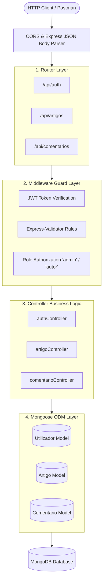
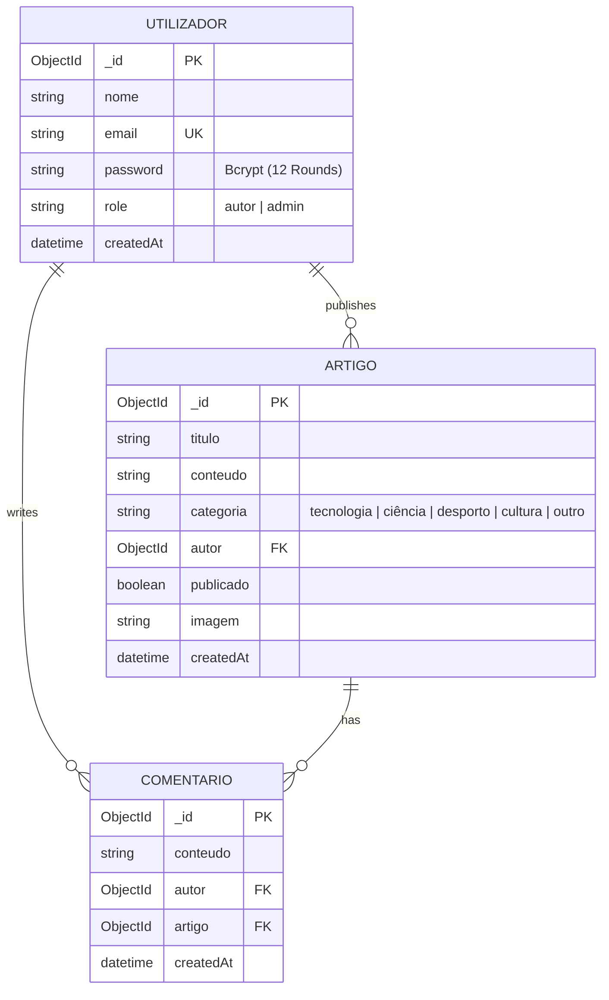

# 📝 Blog Platform API

<p align="center">
  
  
  
  
  
  
  
  
</p>

> A scalable, production-ready RESTful blogging engine engineered with **Node.js**, **Express 5**, and **MongoDB (Mongoose ODM)**. Features a strict **Layered MVC Architecture**, Role-Based Access Control (**RBAC**), paginated article feeds with category filtering, and nested comment threads.

---

## ⚡ Architecture & Layered Design



---

## 📊 Database Schema & Relationships (ERD)



---

## ✨ Key Features

* **Strict Layered MVC Architecture:** High separation of concerns between Routes, Controllers, Mongoose Models, and Custom Middlewares.
* **Role-Based Access Control (RBAC):** Authors can only edit and delete their own articles and comments, while Administrators retain platform-wide moderation rights.
* **Smart Article Feed:** Built-in server-side pagination (`page`, `limit`) and category filters (`?categoria=tecnologia`).
* **Nested Comments:** Threaded comments linked directly to articles with referential integrity.
* **Defensive Error Handling:** Centralized middleware that gracefully transforms MongoDB `CastError` (invalid ObjectIDs), duplicate key code `11000`, and validation errors into user-friendly JSON.
* **Dual-Language Endpoints:** Supports Portuguese (`/api/artigos`, `/api/comentarios`) and English aliases (`/api/posts`, `/api/comments`).
* **Automated Postman Collection:** Includes pre-configured requests with automated JWT token capture.

---

## 📑 API Endpoints Reference

### 🔐 Authentication (`/api/auth`)

| Method | Endpoint | Access | Description | Payload Example |
| :--- | :--- | :--- | :--- | :--- |
| `POST` | `/api/auth/register` | Public | Register a new author or admin | `{"nome": "Afonso", "email": "a@ex.com", "password": "Pass"}` |
| `POST` | `/api/auth/login` | Public | Login and receive signed JWT token | `{"email": "a@ex.com", "password": "Pass"}` |
| `GET` | `/api/auth/me` | 🔒 **Bearer JWT** | Retrieve current user profile | _None_ |

### 📰 Articles (`/api/artigos` or `/api/posts`)

| Method | Endpoint | Access | Description | Payload Example |
| :--- | :--- | :--- | :--- | :--- |
| `GET` | `/api/artigos` | Public | List published articles (supports `?page=1&limit=10&categoria=tecnologia`) | _None_ |
| `GET` | `/api/artigos/:id` | Public | Get single article by ID with author info | _None_ |
| `POST` | `/api/artigos` | 🔒 **Bearer JWT** | Publish a new article (Author auto-assigned) | `{"titulo": "Tech", "conteudo": "...", "categoria": "tecnologia", "publicado": true}` |
| `PUT` | `/api/artigos/:id` | 🔒 **Author / Admin** | Update existing article | `{"titulo": "Updated Title"}` |
| `DELETE` | `/api/artigos/:id` | 🔒 **Author / Admin** | Delete article | _None_ |

### 💬 Comments (`/api/artigos/:artigoId/comentarios` & `/api/comentarios`)

| Method | Endpoint | Access | Description | Payload Example |
| :--- | :--- | :--- | :--- | :--- |
| `GET` | `/api/artigos/:artigoId/comentarios` | Public | List all comments for an article | _None_ |
| `POST` | `/api/artigos/:artigoId/comentarios` | 🔒 **Bearer JWT** | Add comment to article | `{"conteudo": "Great article!"}` |
| `DELETE` | `/api/comentarios/:id` | 🔒 **Author / Admin** | Delete a comment | _None_ |

---

## 🛠️ Quickstart & Local Setup

### 1. Prerequisites
* **Node.js** v20+
* **MongoDB** (Local instance or [MongoDB Atlas](https://www.mongodb.com/atlas) connection)

### 2. Clone the Repository
```bash
git clone https://github.com/Afonsojlc/blog-api.git
cd blog-api
```

### 3. Install Dependencies
```bash
npm install
```

### 4. Configure Environment Variables
Copy `.env.example` to `.env`:
```bash
cp .env.example .env
```
Update your `.env` with your MongoDB connection string and JWT secret:
```env
PORT=3000
MONGODB_URI="mongodb://localhost:27017/blog_db"
JWT_SECRET="your_jwt_secret_key_change_in_production"
JWT_EXPIRES_IN="7d"
```

### 5. Run the Server
```bash
# Production mode
npm start

# Development mode (auto-reload with nodemon)
npm run dev
```
The server will start at `http://localhost:3000`.

---

## 📬 Testing with Postman

A complete Postman collection is included in the root directory: [`blog-api.postman_collection.json`](blog-api.postman_collection.json).

### Automatic Token Magic:
1. Open **Postman** and import `blog-api.postman_collection.json`.
2. Run the **`Login User`** request.
3. ✨ **Automatic Authorization:** The test script automatically stores the returned JWT token into the `{{token}}` collection variable.
4. All protected requests (`Create Article`, `Update Article`, `Create Comment`, `Get Profile`) will authenticate immediately without manual token copying!

---

## 📁 Repository Structure

```text
blog-api/
├── src/
│   ├── config/
│   │   └── db.js                 # MongoDB connection logic (Mongoose)
│   ├── controllers/
│   │   ├── artigoController.js   # Article CRUD & pagination
│   │   ├── authController.js     # User registration & JWT login
│   │   └── comentarioController.js # Comment thread handling
│   ├── middleware/
│   │   ├── auth.js               # JWT verification & RBAC role guards
│   │   ├── errorHandler.js       # Centralized error handler (CastError, 11000)
│   │   └── validar.js            # Express-validator result parser
│   ├── models/
│   │   ├── Artigo.js             # Article schema
│   │   ├── Comentario.js         # Comment schema
│   │   └── Utilizador.js         # User schema with bcrypt pre-save hook
│   ├── routes/
│   │   ├── artigos.js            # Article route declarations
│   │   ├── auth.js               # Auth route declarations
│   │   └── comentarios.js        # Comment route declarations
│   └── app.js                    # Express application entry point
├── .env.example                  # Environment configuration template
├── .gitignore                    # Git exclusions (.env, node_modules, .DS_Store)
├── blog-api.postman_collection.json # Ready-to-use Postman test suite
├── package.json                  # Dependencies and scripts
└── README.md                     # Documentation
```

---

## 👤 Author

**Afonso Carvalho**
* GitHub: [@Afonsojlc](https://github.com/Afonsojlc)
* LinkedIn: [Afonso Carvalho](https://www.linkedin.com/in/afonso-carvalho-64796328a/)

---

## 📄 License

This project is licensed under the [MIT License](LICENSE).
